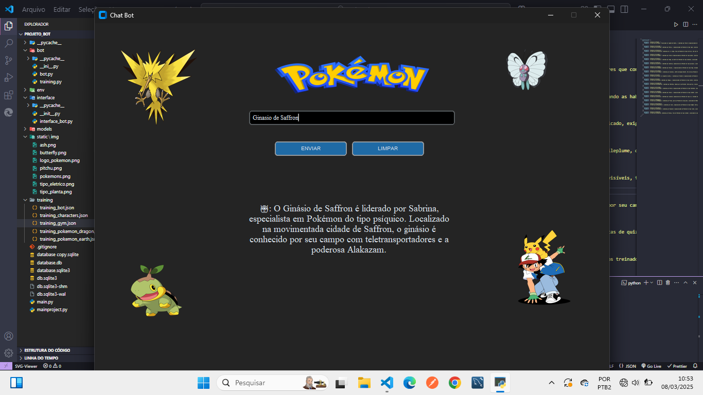

<<<<<<< HEAD
# CHATBOT-POKEMON 🤖

Chatbot criado em python com a biblioteca chattterbot com o intuito de responder perguntas sobre o mundo pokemon, para um bom funcionamento do bot é necessário fazer as perguntas de acordo com os arquivos de treinamento que estão no formato json.

#

#

#

#

=======
# CHATBOT-POKEMON
Chatbot criado em python com a biblioteca chattterbot com o intuito de responder perguntas sobre o mundo pokemon, para um bom funcionamento do bot é necessário fazer as perguntas de acordo com os arquivos de treinamento que estão no formato json.  
>>>>>>> ceebebeeeea5f7f0057b511b357ffd2ebb8546f5
